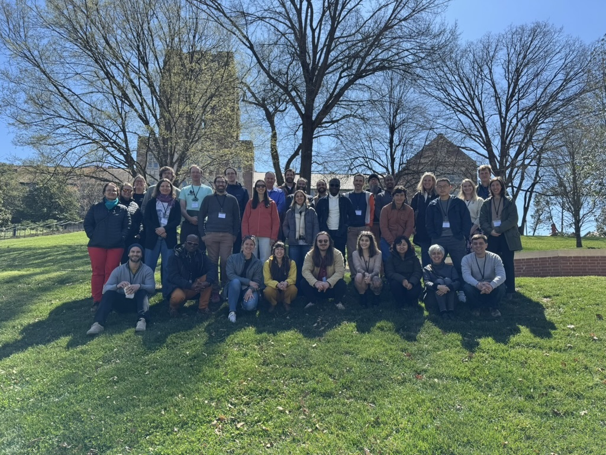
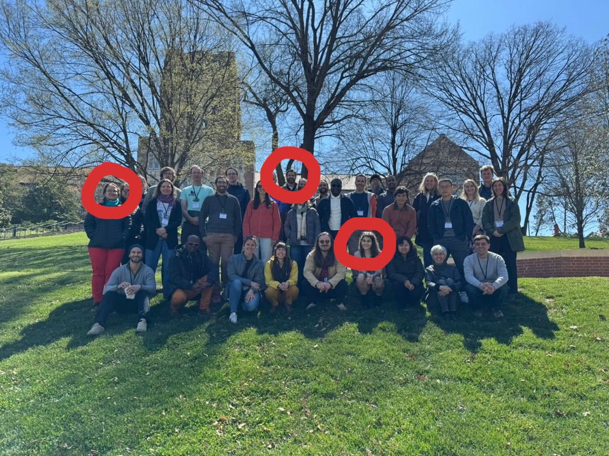
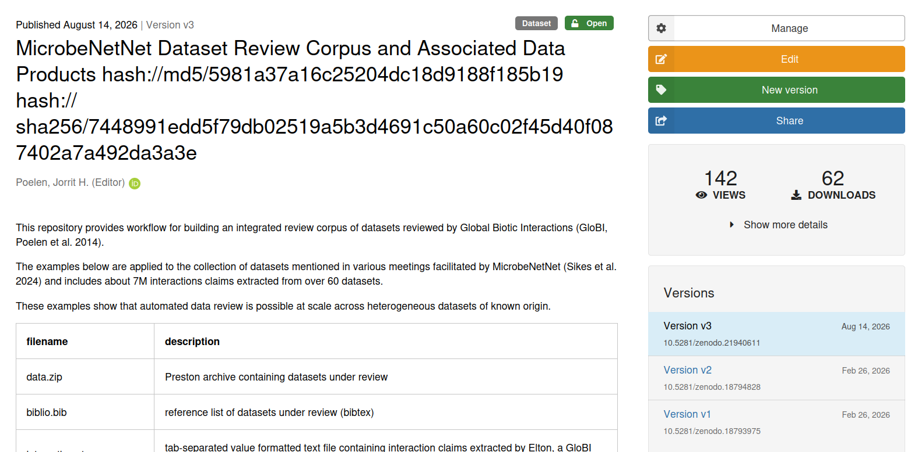
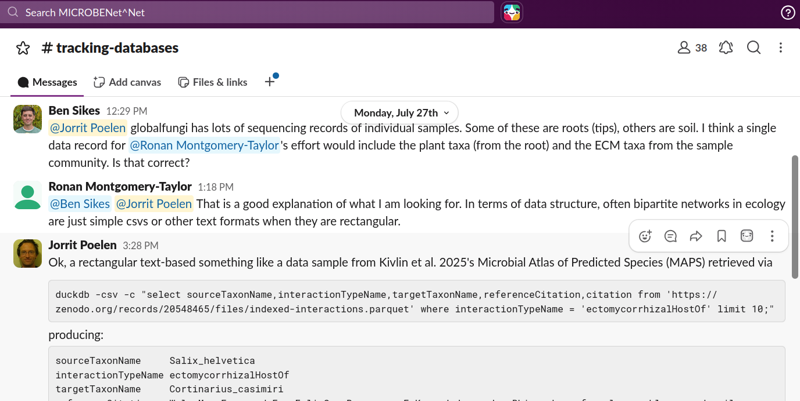

---
author:
  - Jorrit Poelen (UC Santa Barbara Cheadle Center, Ronin Institute)
title: "MicrobeNetNet - Connecting Datasets/Nodes/Networks Across Disciplinary Siloes"
subtitle: "as reflected in data connections"
date: 2026-09-11
aspectratio: 169
---

## Guiding Questions

### Hey, are we unsiloed yet?

### Do *you* have examples of unsilo-ing?

### How do *you* think we should unsilo?

## Ben's Challenge to Jorrit 

> \[...\]
> New Datasets/Nodes/Networks that might be connected (Jorrit)
>
> 1. What data are there (plain language summaries)?
>
> 2. How can people access what are there?
>
> 3. Case study, Review example of FRED and MaarjAM networks - how you found the data, wed them. Generalizable for other efforts?
> \[...\]
> [^1]

[^1]: Sikes, B. 2026-09-08. Pers. Comm.

## Are we unsiloed yet? Revisiting MN^N Theme and Grand Challenge.

> \[…\] MICROBENet^Net [^2][1] Theme and Grand Challenge: Plants and microorganisms regulate a diverse array of processes that modulate the Earth system. Yet, we know remarkably little about how variable plant-microbial interactions are across the globe, how microbial connections with plants respond to global change, and if changes in plant-microbe interactions will lead to predictable changes in plant, ecosystem, and macro-scale ecology. While microbial ecologists and plant ecologists both explore questions about geography, interactions, and function, this work has often occurred in plant or microbial silos. **Focusing on either plants or microbes resulted in the development of distinct disciplinary vocabularies and meanings, even when using similar tools and asking questions across similar scales.** \[…\]

[^2]: Sikes, B.A., Zanne E.A., Classen, A.T, Kivlin S.N. (2024) MICROBENet-Net: Multi-Institute Collaborative Research on BElowground plant-microbial interactions Network of Networks. 2024/2028 NSF AccelNet Award 2412561 https://microbenetwork.net/ https://globalbioticinteractions.org/microbenetnet

## Are we unsiloed yet? MN^N 2025 Colloquium in Knoxville, TN.

{height=75%} [^3].

[^3]: Sikes, B., Classen, A., Kivlin, S., Zanne, A.& Holly Andres. (2025, May 29). 2025 MicrobeNet^Net Colloquium. Zenodo. 2025 MicrobeNet^Net Colloquium, Knoxville, TN. https://doi.org/10.5281/zenodo.15547951

## Are we unsiloed yet? MN^N 2025 Colloquium in Knoxville, TN. FRED and MaarjAM meet.

{height=75%} [^3].

## Are we unsiloed yet? FRED and MaarjAM

 * FRED/MaarjAM met in person and data (csv, xslx->csv) was shared in person
 * FRED/MaarjAM data openly published 
    * [https://github.com/globalbioticinteractions/fred](https://github.com/globalbioticinteractions/fred)
    * [https://github.com/globalbioticinteractions/maarjam](https://github.com/globalbioticinteractions/maarjam)
 * GloBI integration tools used to connect FRED/MaarjAM via plant taxonomic names (World of Flora Online)
 * Early applications include GloBI Data Reviews and Plant Overlap Analysis.  
    * [Elton, Nomer, & Preston. (2026). Versioned Archive and Review of Biotic Interactions and Taxon Names Found within globalbioticinteractions/fred hash://md5/6db551793883f575d828d8a600e1af72. Zenodo. https://doi.org/10.5281/zenodo.20547776](https://doi.org/10.5281/zenodo.20547776)
    * [Elton, Nomer, & Preston. (2026). Versioned Archive and Review of Biotic Interactions and Taxon Names Found within globalbioticinteractions/maarjam hash://md5/4578fcd83fceba1f11c269d8aaf1118a. Zenodo. https://doi.org/10.5281/zenodo.20548434](https://doi.org/10.5281/zenodo.20548434)
    * [https://github.com/jhpoelen/fungal-plant-host-overlap/tree/0faeeeae123b5d8f53576feb1d607ffb5d2bd3ac](https://github.com/jhpoelen/fungal-plant-host-overlap/tree/0faeeeae123b5d8f53576feb1d607ffb5d2bd3ac)

## Are we unsiloed yet? A "Plain Language" (NSF) Update

> Since the inaugural MicrobeNetNet ([1], MN^N) colloquium in Knoxville, TN 2025-03-20/2025-03-24 [2], Jorrit Poelen has collaborated with many MN^N participants and nodes to use existing methods [3,4] to review and integrate existing datasets, databases, and collections describing plant-microbe interactions into the openly accessible and citable MicrobeNetNet Data Review Corpus [5,6]. The **2026-08-14 version of the MN^N Review Corpus is a global dataset containing over 7 million claims sourced from MycoPortal (a data portal of a consortium of Mycology Collections), USDA United States National Fungus Collections Fungus-Host Dataset, Microbial Atlas of Predicted Species (MAPS), AusTrait, Fine Root Ecology Database (FRED), MaarjAM, FungalTraits, FunFun, Global(AM)Fungi, International Collection of Microorganisms from Plants (ICMP), MycoDB, USDA ARS Culture Collection (NRRL), and Unite and more.** \[...\] We expect to continue to integrate existing datasets \[...\], but also improve the data infrastructures [7] that help keep this openly data accessible. [^4]

[^4]: Excerpt from Jorrit's update submitted to Ben for NSF report on 2026-08-14

## Are we unsiloed yet? MNˆN Dataset Review Corpus

 [^5]

[^5]: Poelen, J. H. (2026). MicrobeNetNet Dataset Review Corpus and Associated Data Products hash://md5/5981a37a16c25204dc18d9188f185b19 hash://sha256/7448991edd5f79db02519a5b3d4691c50a60c02f45d40f087402a7a492da3a3e [Dataset]. Zenodo. https://doi.org/10.5281/zenodo.21940611

## Are we unsiloed yet? MNˆN Dataset Review Corpus

~~~~~~~
(You or Your Colleagues)
  -[:curate]->
    (Original Data)
      -[:usedIn]-> 
       (MNN Data Review)
         -[:partOf]-> 
            (MNN Data Review Corpus)
               -[:usedBy]->
                  (... everyone?)
~~~~~~~

## Are we unsiloed yet? Example use.

{height=75%}

## Guiding Questions

### Hey, are we unsiloed yet?

### Do *you* have examples of unsilo-ing?

### How do *you* think we should unsilo?

## References

[1] Sikes, B.A., Zanne E.A., Classen, A.T, Kivlin S.N. (2024) MICROBENet-Net: Multi-Institute Collaborative Research on BElowground plant-microbial interactions Network of Networks. 2024/2028 NSF AccelNet Award 2412561 https://microbenetwork.net/ https://globalbioticinteractions.org/microbenetnet

[2] Sikes, B., Classen, A., Kivlin, S., Zanne, A.& Holly Andres. (2025, May 29). 2025 MicrobeNet^Net Colloquium. Zenodo. 2025 MicrobeNet^Net Colloquium, Knoxville, TN. https://doi.org/10.5281/zenodo.15547951

[3] Jorrit H. Poelen, James D. Simons and Chris J. Mungall. (2014). Global Biotic Interactions: An open infrastructure to share and analyze species-interaction datasets. Ecological Informatics. https://doi.org/10.1016/j.ecoinf.2014.08.005.

[4] Elliott M.J., Poelen, J.H. & Fortes, J.A.B. (2023) Signing data citations enables data verification and citation persistence. Sci Data. https://doi.org/10.1038/s41597-023-02230-y hash://sha256/f849c870565f608899f183ca261365dce9c9f1c5441b1c779e0db49df9c2a19d

[5] Poelen, J. H. (2026, Feb). MicrobeNetNet Dataset Review Corpus and Associated Data Products hash://md5/5981a37a16c25204dc18d9188f185b19 hash://sha256/7448991edd5f79db02519a5b3d4691c50a60c02f45d40f087402a7a492da3a3e [Data set]. Zenodo. https://doi.org/10.5281/zenodo.18793975

[6] Poelen, J. H. (2026). MicrobeNetNet Dataset Review Corpus and Associated Data Products hash://md5/5981a37a16c25204dc18d9188f185b19 hash://sha256/7448991edd5f79db02519a5b3d4691c50a60c02f45d40f087402a7a492da3a3e [Dataset]. Zenodo. https://doi.org/10.5281/zenodo.21940611

[7] Poelen, J. H. (2026) Data Dryad Feature Request: retrieve content by hash / checksum. GitHub. See also https://github.com/datadryad/dryad-app/pull/3107 https://github.com/datadryad/dryad-product-roadmap/issues/5182
 
